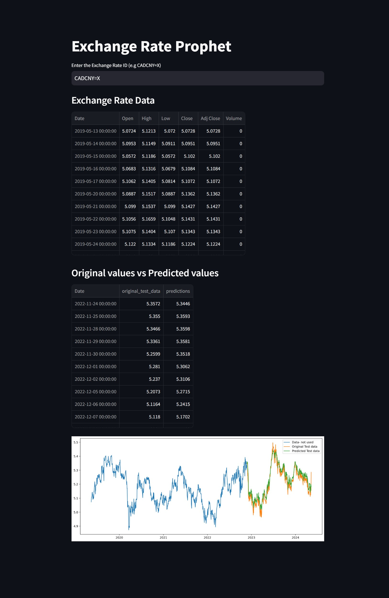

# ExchangeRateProphet

ExchangeRateProphet is a Streamlit-based Python web application designed to provide users with historical exchange rate data and predictions based on a custom model. This project also includes a Jupyter Notebook detailing the model's architecture, training process, and evaluation.

## Features

- **Historical Data Analysis**: Input the code of a currency rate and retrieve historical exchange rate data.
- **Prediction Results**: Get predictions for future exchange rates based on the model.
- **Model Comparison**: Compare real exchange rate data with model predictions to assess accuracy and performance.

## Running the Streamlit App 

### Online
https://exchangrateprophet.streamlit.app/

### Local   
1. **Install Dependencies**: Install the required Python packages.
   ```bash
   pip install -r requirements.txt
    ```

2. **Run the Streamlit App**: Start the Streamlit app.
    ```bash
    streamlit run ProphetApp.py
   ```
   

